# Design Document

## Overview

This design describes the architecture for a premium executive personal landing page for Carlos Alberto Figueroa Martínez. The application is a single-page Angular 17+ application using standalone components, signals for state management, and server-side rendering (SSR) deployed on Vercel. The visual identity uses a dark premium theme with glassmorphism effects, GSAP-powered animations, and a particle canvas background. A serverless API endpoint persists contact form submissions to a Neon PostgreSQL database.

### Key Technical Decisions

| Decision | Choice | Rationale |
|----------|--------|-----------|
| Framework | Angular 17+ standalone components | Modern Angular with signals, SSR support, tree-shakeable |
| Styling | SCSS design tokens + TailwindCSS utilities | Tokens for brand consistency, Tailwind for rapid layout |
| Animations | GSAP + Intersection Observer | Industry-standard animation library with scroll-trigger support |
| SSR | Angular SSR with @vercel/node adapter | SEO-critical for landing page, Vercel-native deployment |
| Database | Neon PostgreSQL (serverless) | Serverless-friendly, auto-scaling, SSL by default |
| Icons | Lucide Angular | Lightweight, tree-shakeable SVG icon library |
| Fonts | Google Fonts (Inter + Bricolage Grotesque) | Premium typography with system fallbacks |
| Deployment | Vercel | Edge network, serverless functions, Angular SSR adapter |

## Architecture

### High-Level Architecture Diagram

```mermaid
graph TB
    subgraph "Client (Browser)"
        A[Angular 17+ SPA] --> B[Standalone Components]
        A --> C[GSAP Animation Service]
        A --> D[Particle Canvas Component]
        A --> E[Contact Form Component]
    end

    subgraph "Vercel Edge Network"
        F[CDN / Static Assets]
        G[Angular SSR Handler]
        H[/api/contact Serverless Function]
    end

    subgraph "External Services"
        I[Neon PostgreSQL]
        J[Google Fonts CDN]
    end

    A -->|Initial Request| G
    G -->|Pre-rendered HTML| A
    A -->|Static Assets| F
    E -->|POST /api/contact| H
    H -->|SQL INSERT| I
    A -->|Font Loading| J
```

### Deployment Architecture

```mermaid
graph LR
    subgraph "Vercel Project"
        V1[vercel.json] --> V2[Rewrites Config]
        V2 --> V3[/api/* → Serverless Functions]
        V2 --> V4[/* → Angular SSR Handler]
    end

    subgraph "Build Output"
        B1[dist/browser/] --> B2[Static Assets]
        B3[dist/server/] --> B4[SSR Bundle]
        B5[api/] --> B6[contact.ts]
    end
```

### Component Tree

```mermaid
graph TD
    App[AppComponent] --> Nav[NavbarComponent]
    App --> Hero[HeroSectionComponent]
    App --> Profile[ProfileSectionComponent]
    App --> Achievements[AchievementsSectionComponent]
    App --> Timeline[TimelineSectionComponent]
    App --> Skills[SkillsSectionComponent]
    App --> Education[EducationSectionComponent]
    App --> Contact[ContactSectionComponent]
    App --> Particles[ParticleCanvasComponent]
    App --> ScrollProgress[ScrollProgressBarComponent]
    App --> Footer[FooterComponent]

    Nav --> MobileMenu[MobileMenuOverlayComponent]
    Hero --> TypewriterText[TypewriterDirective]
    Hero --> MetricChip[MetricChipComponent]
    Profile --> OrbitingTags[OrbitingTagsComponent]
    Achievements --> AchievementCard[AchievementCardComponent]
    Achievements --> CountUp[CountUpDirective]
    Timeline --> TimelineNode[TimelineNodeComponent]
    Skills --> SkillCategory[SkillCategoryComponent]
    Skills --> SkillBar[SkillBarComponent]
    Education --> EducationCard[EducationCardComponent]
    Education --> CertBadge[CertificationBadgeComponent]
    Contact --> ContactForm[ContactFormComponent]
```



## Components and Interfaces

### Core Application Module

```typescript
// app.config.ts
import { ApplicationConfig } from '@angular/core';
import { provideRouter } from '@angular/router';
import { provideClientHydration } from '@angular/platform-browser';
import { provideHttpClient, withFetch } from '@angular/common/http';
import { provideAnimations } from '@angular/platform-browser/animations';

export const appConfig: ApplicationConfig = {
  providers: [
    provideRouter([]),
    provideClientHydration(),
    provideHttpClient(withFetch()),
    provideAnimations(),
  ],
};
```

### Services

#### AnimationService

Manages GSAP animations and Intersection Observer triggers.

```typescript
// services/animation.service.ts
@Injectable({ providedIn: 'root' })
export class AnimationService {
  private prefersReducedMotion = signal<boolean>(false);

  initScrollTrigger(element: ElementRef, config: ScrollAnimationConfig): void;
  fadeInStagger(elements: HTMLElement[], staggerDelay: number): gsap.core.Timeline;
  countUp(element: HTMLElement, target: number, duration: number): void;
  cleanup(): void;
}

interface ScrollAnimationConfig {
  threshold: number;       // 0.0 - 1.0
  animationType: 'fadeIn' | 'slideUp' | 'slideLeft' | 'slideRight' | 'countUp';
  duration: number;        // seconds
  staggerDelay?: number;   // seconds
  once: boolean;           // trigger only once
}
```

#### ScrollService

Handles smooth scrolling and scroll position tracking.

```typescript
// services/scroll.service.ts
@Injectable({ providedIn: 'root' })
export class ScrollService {
  scrollProgress = signal<number>(0);       // 0-100
  scrollPosition = signal<number>(0);       // px from top
  activeSection = signal<string>('hero');

  scrollToSection(sectionId: string): void;
  trackScrollProgress(): void;
}
```

#### ContactService

Handles form submission to the Lead API.

```typescript
// services/contact.service.ts
@Injectable({ providedIn: 'root' })
export class ContactService {
  submitLead(data: ContactFormData): Observable<LeadResponse>;
}

interface ContactFormData {
  nombre: string;
  empresa?: string;
  email: string;
  motivo: 'Consultoría' | 'Colaboración' | 'Docencia' | 'Otro';
  mensaje: string;
}

interface LeadResponse {
  success: boolean;
  message: string;
}
```

#### ThemeService

Manages design tokens and accessibility preferences.

```typescript
// services/theme.service.ts
@Injectable({ providedIn: 'root' })
export class ThemeService {
  prefersReducedMotion = signal<boolean>(false);
  fontsLoaded = signal<boolean>(false);

  detectMotionPreference(): void;
  monitorFontLoading(): void;
}
```

### Section Components

#### NavbarComponent

```typescript
// components/navbar/navbar.component.ts
@Component({ standalone: true, selector: 'app-navbar' })
export class NavbarComponent {
  isScrolled = signal<boolean>(false);       // true when > 50px
  isMobileMenuOpen = signal<boolean>(false);
  
  readonly navLinks: NavLink[] = [
    { label: 'Perfil', sectionId: 'profile' },
    { label: 'Logros', sectionId: 'achievements' },
    { label: 'Experiencia', sectionId: 'timeline' },
    { label: 'Habilidades', sectionId: 'skills' },
    { label: 'Educación', sectionId: 'education' },
    { label: 'Contacto', sectionId: 'contact' },
  ];

  toggleMobileMenu(): void;
  closeMobileMenu(): void;
  navigateToSection(sectionId: string): void;
}
```

#### HeroSectionComponent

```typescript
// components/hero-section/hero-section.component.ts
@Component({ standalone: true, selector: 'app-hero-section' })
export class HeroSectionComponent implements AfterViewInit {
  readonly titles: string[] = [
    'Líder en Transformación Digital',
    'Especialista en IA Aplicada al Negocio',
    'Arquitecto de Operaciones Inteligentes',
    'Product Owner Senior | Docente Universitario',
  ];

  readonly metrics: MetricChip[] = [
    { value: '18+', label: 'Años de experiencia' },
    { value: '95%', label: 'Máxima eficiencia lograda' },
    { value: '8+', label: 'Sectores impactados' },
    { value: '+100', label: 'Proyectos gestionados' },
  ];

  currentTitle = signal<string>('');
  isTyping = signal<boolean>(true);

  downloadCV(): void;
  scrollToAchievements(): void;
}
```

#### ContactFormComponent

```typescript
// components/contact-section/contact-form.component.ts
@Component({ standalone: true, selector: 'app-contact-form' })
export class ContactFormComponent {
  formGroup: FormGroup;
  isSubmitting = signal<boolean>(false);
  submitStatus = signal<'idle' | 'success' | 'error' | 'rate-limited'>('idle');

  readonly motivoOptions = ['Consultoría', 'Colaboración', 'Docencia', 'Otro'];

  onSubmit(): void;
  resetForm(): void;
}
```

#### ParticleCanvasComponent

```typescript
// components/particle-canvas/particle-canvas.component.ts
@Component({ standalone: true, selector: 'app-particle-canvas' })
export class ParticleCanvasComponent implements AfterViewInit, OnDestroy {
  @ViewChild('canvas') canvasRef!: ElementRef<HTMLCanvasElement>;
  
  private particles: Particle[] = [];
  private animationFrameId: number = 0;
  private nodeCount = signal<number>(60);

  initCanvas(): void;
  animate(): void;
  handleResize(): void;
  destroy(): void;
}

interface Particle {
  x: number;
  y: number;
  vx: number;
  vy: number;
  radius: number;
}
```

### Serverless API

#### Contact API Handler

```typescript
// api/contact.ts
import { VercelRequest, VercelResponse } from '@vercel/node';
import { Pool } from '@neondatabase/serverless';

export default async function handler(
  req: VercelRequest,
  res: VercelResponse
): Promise<void>;

// Validation
function validateContactForm(body: unknown): ValidationResult;
function hashIP(ip: string): string;
function checkRateLimit(pool: Pool, ipHash: string): Promise<boolean>;

interface ValidationResult {
  valid: boolean;
  errors: Record<string, string>;
}
```

### Directives

#### TypewriterDirective

```typescript
// directives/typewriter.directive.ts
@Directive({ standalone: true, selector: '[appTypewriter]' })
export class TypewriterDirective implements OnInit, OnDestroy {
  @Input() titles: string[] = [];
  @Input() typingSpeed: number = 80;    // ms per character
  @Input() pauseDuration: number = 2000; // ms pause on complete title
  
  currentText = signal<string>('');
}
```

#### CountUpDirective

```typescript
// directives/count-up.directive.ts
@Directive({ standalone: true, selector: '[appCountUp]' })
export class CountUpDirective implements AfterViewInit {
  @Input() targetValue: number = 0;
  @Input() duration: number = 2000;     // ms
  @Input() threshold: number = 0.5;     // intersection ratio
  
  currentValue = signal<number>(0);
  hasTriggered = signal<boolean>(false);
}
```

#### IntersectionObserverDirective

```typescript
// directives/intersection-observer.directive.ts
@Directive({ standalone: true, selector: '[appInView]' })
export class IntersectionObserverDirective implements AfterViewInit, OnDestroy {
  @Input() threshold: number = 0.2;
  @Output() inView = new EventEmitter<boolean>();
  
  isVisible = signal<boolean>(false);
}
```

## Data Models

### Contact Form Lead (Neon PostgreSQL)

```sql
CREATE TABLE leads (
  id SERIAL PRIMARY KEY,
  nombre VARCHAR(100) NOT NULL,
  empresa VARCHAR(100),
  email VARCHAR(150) NOT NULL,
  motivo VARCHAR(50) NOT NULL CHECK (motivo IN ('Consultoría', 'Colaboración', 'Docencia', 'Otro')),
  mensaje TEXT NOT NULL CHECK (char_length(mensaje) <= 1000),
  created_at TIMESTAMP WITH TIME ZONE DEFAULT NOW(),
  ip_hash VARCHAR(64) NOT NULL
);

CREATE INDEX idx_leads_ip_hash_created ON leads (ip_hash, created_at DESC);
CREATE INDEX idx_leads_created_at ON leads (created_at DESC);
```

### TypeScript Interfaces

```typescript
// models/lead.interface.ts
export interface Lead {
  id: number;
  nombre: string;
  empresa: string | null;
  email: string;
  motivo: 'Consultoría' | 'Colaboración' | 'Docencia' | 'Otro';
  mensaje: string;
  created_at: string;
  ip_hash: string;
}

// models/metric-chip.interface.ts
export interface MetricChip {
  value: string;
  label: string;
}

// models/nav-link.interface.ts
export interface NavLink {
  label: string;
  sectionId: string;
}

// models/achievement.interface.ts
export interface Achievement {
  percentage: number;
  title: string;
  company: string;
}

// models/timeline-entry.interface.ts
export interface TimelineEntry {
  company: string;
  position: string;
  startYear: number;
  endYear: number | null;  // null = present
  responsibilities: string[];
  isExpanded: boolean;
}

// models/skill-category.interface.ts
export interface SkillCategory {
  title: string;
  tags: string[];
}

// models/skill-bar.interface.ts
export interface SkillBar {
  label: string;
  percentage: number;
}

// models/education-entry.interface.ts
export interface EducationEntry {
  degree: string;
  institution: string;
  yearRange: string;
  status?: 'en curso' | 'completado';
}

// models/certification.interface.ts
export interface Certification {
  title: string;
  institution?: string;
  year: number;
}
```

### Design Tokens (SCSS)

```scss
// styles/_tokens.scss

// Color Palette
$color-bg-primary: #0A0E1A;
$color-bg-secondary: #111827;
$color-accent-cyan: #00D4FF;
$color-accent-violet: #7B61FF;
$color-accent-gold: #F0C040;
$color-text-primary: #FFFFFF;
$color-text-secondary: rgba(255, 255, 255, 0.7);
$color-text-muted: rgba(255, 255, 255, 0.5);

// Glassmorphism
$glass-bg-opacity-min: 0.05;
$glass-bg-opacity-max: 0.15;
$glass-blur-min: 12px;
$glass-blur-max: 20px;
$glass-border: 1px solid rgba(255, 255, 255, 0.1);

// Typography
$font-body: 'Inter', system-ui, -apple-system, sans-serif;
$font-heading: 'Bricolage Grotesque', system-ui, -apple-system, sans-serif;
$font-size-base: 16px;
$font-weight-body: 400;
$font-weight-emphasis: 600;
$font-weight-heading: 700;
$font-size-h1: 56px;
$font-size-h2: 40px;
$font-size-h3: 32px;
$font-size-h4: 24px;

// Spacing Scale (8px base)
$space-1: 4px;
$space-2: 8px;
$space-3: 12px;
$space-4: 16px;
$space-5: 24px;
$space-6: 32px;
$space-7: 48px;
$space-8: 64px;
$space-9: 96px;

// Gradients
$gradient-accent: linear-gradient(135deg, $color-accent-cyan, $color-accent-violet);
$gradient-text: linear-gradient(90deg, $color-accent-cyan, $color-accent-violet);
$gradient-ring: conic-gradient(from 0deg, $color-accent-cyan, $color-accent-violet, $color-accent-cyan);

// Breakpoints
$bp-mobile: 375px;
$bp-tablet: 768px;
$bp-desktop: 1024px;
$bp-wide: 1440px;

// Animation
$anim-duration-fast: 300ms;
$anim-duration-normal: 600ms;
$anim-duration-slow: 1500ms;
$anim-easing: cubic-bezier(0.4, 0, 0.2, 1);
```

### Vercel Configuration

```json
// vercel.json
{
  "version": 2,
  "buildCommand": "ng build",
  "outputDirectory": "dist/landing-page-cv/browser",
  "framework": "angular",
  "rewrites": [
    { "source": "/api/(.*)", "destination": "/api/$1" },
    { "source": "/(.*)", "destination": "/index.html" }
  ],
  "functions": {
    "api/contact.ts": {
      "runtime": "@vercel/node@3",
      "maxDuration": 15
    }
  }
}
```

## Correctness Properties

*A property is a characteristic or behavior that should hold true across all valid executions of a system — essentially, a formal statement about what the system should do. Properties serve as the bridge between human-readable specifications and machine-verifiable correctness guarantees.*

### Property 1: Contact form validation rejects all invalid inputs

*For any* contact form payload where at least one required field (nombre, email, mensaje) is empty or the email does not match the pattern `local-part@domain.tld`, the `validateContactForm` function SHALL return `{ valid: false }` with at least one error entry, and no database write SHALL occur.

**Validates: Requirements 8.5, 8.6**

### Property 2: IP hashing is deterministic and non-reversible

*For any* IP address string, calling `hashIP` with the same input SHALL always produce the same output string, and the output SHALL NOT contain the original IP address as a substring.

**Validates: Requirements 8.7**

### Property 3: Rate limiter enforces 3 submissions per IP per hour

*For any* IP address and any sequence of submission timestamps, the rate limiter SHALL allow the first 3 submissions within any 1-hour rolling window and reject all subsequent submissions from the same IP until the window expires.

**Validates: Requirements 8.8**

### Property 4: Typewriter cycles through all titles in sequence

*For any* non-empty array of title strings, the typewriter function SHALL produce characters that, when accumulated, form each title in array order, cycling back to the first title after the last.

**Validates: Requirements 2.3**

### Property 5: Count-up animation reaches exact target value

*For any* target integer between 0 and 100 and any positive duration, the count-up function SHALL produce a final value exactly equal to the target value upon completion.

**Validates: Requirements 4.2**

### Property 6: Timeline entries are sorted in reverse chronological order

*For any* collection of timeline entries with start years, the rendered order SHALL satisfy the invariant that each entry's start year is greater than or equal to the next entry's start year (descending order).

**Validates: Requirements 5.2**

### Property 7: Skill categories contain between 3 and 8 tags

*For any* skill category in the application data, the number of tags SHALL be at least 3 and at most 8.

**Validates: Requirements 6.8**

## Error Handling

### Client-Side Error Handling

| Scenario | Behavior |
|----------|----------|
| Form validation failure | Inline error messages adjacent to invalid fields; form not submitted |
| API submission failure (5xx) | Error toast/message displayed; form data preserved for retry |
| Rate limit exceeded (429) | Rate limit message displayed; form disabled temporarily |
| CV download failure | Error message indicating file unavailable |
| Google Fonts timeout (>3s) | Fallback to system sans-serif stack; no layout shift |
| SSR hydration mismatch | Client-side re-render; no visible error to user |

### Server-Side Error Handling

| Scenario | HTTP Status | Response |
|----------|-------------|----------|
| Valid submission | 200 | `{ success: true, message: "..." }` |
| Validation error | 400 | `{ success: false, errors: { field: "message" } }` |
| Rate limit exceeded | 429 | `{ success: false, message: "Rate limit reached..." }` |
| DATABASE_URL not set | 503 | `{ success: false, message: "Database not configured" }` |
| DB connection timeout (>10s) | 504 | `{ success: false, message: "Gateway timeout" }` |
| Unexpected server error | 500 | `{ success: false, message: "Internal server error" }` |

### Graceful Degradation Strategy

- **Particle canvas**: Falls back to static background if canvas API unavailable
- **GSAP animations**: Elements shown in final state if GSAP fails to load
- **prefers-reduced-motion**: All animations disabled; content shown immediately
- **JavaScript disabled**: SSR provides full content; interactive features degrade gracefully
- **Neon DB unavailable**: Contact form shows alternative contact methods (email, LinkedIn)

## Testing Strategy

### Unit Tests (Jasmine + Karma / Jest)

Focus on specific examples and edge cases:

- **Component rendering**: Verify each section component renders correct content
- **Responsive behavior**: Test breakpoint-specific layouts at 375px, 768px, 1024px, 1440px
- **Form validation**: Test specific invalid inputs (empty name, malformed email, oversized message)
- **Navigation**: Test smooth scroll triggers and mobile menu toggle
- **Accessibility**: Verify aria-labels, alt text, keyboard navigation, focus management
- **Error states**: Test CV download failure, API error responses, font loading timeout

### Property-Based Tests (fast-check)

Use `fast-check` library for TypeScript property-based testing. Each property test runs minimum 100 iterations.

| Property | Test Target | Generator Strategy |
|----------|-------------|-------------------|
| Property 1: Validation rejects invalid inputs | `validateContactForm()` | Generate objects with random combinations of empty/missing required fields and malformed emails |
| Property 2: IP hash determinism | `hashIP()` | Generate random IPv4/IPv6 strings |
| Property 3: Rate limiter enforcement | `checkRateLimit()` | Generate sequences of timestamps within/outside 1-hour windows |
| Property 4: Typewriter cycling | Typewriter state machine | Generate random string arrays of varying lengths |
| Property 5: Count-up target accuracy | Count-up function | Generate random integers [0-100] and durations [500-3000ms] |
| Property 6: Timeline ordering | Timeline sort function | Generate random arrays of timeline entries with various start years |
| Property 7: Skill tag bounds | Skill category data | Generate category objects with random tag arrays |

**Configuration:**
- Library: `fast-check` (npm package)
- Minimum iterations: 100 per property
- Tag format: `Feature: executive-landing-page, Property {N}: {title}`

### Integration Tests

- **Contact API end-to-end**: Submit form → verify Neon DB record created
- **SSR rendering**: Request page → verify HTML contains pre-rendered content
- **Vercel deployment**: Verify rewrites, serverless function routing

### Smoke Tests

- **Lighthouse CI**: Performance ≥ 90, Accessibility ≥ 95, SEO = 100
- **Bundle size**: Verify < 200KB gzipped
- **WCAG contrast**: Automated axe-core scan
- **Deployment config**: Verify vercel.json, environment variables

### Project File Structure

```
src/
├── app/
│   ├── components/
│   │   ├── navbar/
│   │   │   ├── navbar.component.ts
│   │   │   ├── navbar.component.html
│   │   │   ├── navbar.component.scss
│   │   │   └── mobile-menu-overlay.component.ts
│   │   ├── hero-section/
│   │   │   ├── hero-section.component.ts
│   │   │   ├── hero-section.component.html
│   │   │   ├── hero-section.component.scss
│   │   │   └── metric-chip.component.ts
│   │   ├── profile-section/
│   │   │   ├── profile-section.component.ts
│   │   │   ├── profile-section.component.html
│   │   │   ├── profile-section.component.scss
│   │   │   └── orbiting-tags.component.ts
│   │   ├── achievements-section/
│   │   │   ├── achievements-section.component.ts
│   │   │   ├── achievements-section.component.html
│   │   │   ├── achievements-section.component.scss
│   │   │   └── achievement-card.component.ts
│   │   ├── timeline-section/
│   │   │   ├── timeline-section.component.ts
│   │   │   ├── timeline-section.component.html
│   │   │   ├── timeline-section.component.scss
│   │   │   └── timeline-node.component.ts
│   │   ├── skills-section/
│   │   │   ├── skills-section.component.ts
│   │   │   ├── skills-section.component.html
│   │   │   ├── skills-section.component.scss
│   │   │   ├── skill-category.component.ts
│   │   │   └── skill-bar.component.ts
│   │   ├── education-section/
│   │   │   ├── education-section.component.ts
│   │   │   ├── education-section.component.html
│   │   │   ├── education-section.component.scss
│   │   │   ├── education-card.component.ts
│   │   │   └── certification-badge.component.ts
│   │   ├── contact-section/
│   │   │   ├── contact-section.component.ts
│   │   │   ├── contact-section.component.html
│   │   │   ├── contact-section.component.scss
│   │   │   └── contact-form.component.ts
│   │   ├── particle-canvas/
│   │   │   ├── particle-canvas.component.ts
│   │   │   └── particle-canvas.component.scss
│   │   ├── scroll-progress-bar/
│   │   │   └── scroll-progress-bar.component.ts
│   │   └── footer/
│   │       └── footer.component.ts
│   ├── directives/
│   │   ├── typewriter.directive.ts
│   │   ├── count-up.directive.ts
│   │   └── intersection-observer.directive.ts
│   ├── services/
│   │   ├── animation.service.ts
│   │   ├── scroll.service.ts
│   │   ├── contact.service.ts
│   │   └── theme.service.ts
│   ├── models/
│   │   ├── lead.interface.ts
│   │   ├── metric-chip.interface.ts
│   │   ├── nav-link.interface.ts
│   │   ├── achievement.interface.ts
│   │   ├── timeline-entry.interface.ts
│   │   ├── skill-category.interface.ts
│   │   ├── skill-bar.interface.ts
│   │   ├── education-entry.interface.ts
│   │   └── certification.interface.ts
│   ├── app.component.ts
│   ├── app.component.html
│   ├── app.component.scss
│   └── app.config.ts
├── styles/
│   ├── _tokens.scss
│   ├── _glassmorphism.scss
│   ├── _typography.scss
│   ├── _animations.scss
│   └── styles.scss
├── assets/
│   ├── images/
│   │   ├── profile-photo.webp
│   │   └── og-image.webp
│   └── documents/
│       └── cv-carlos-figueroa.pdf
├── environments/
│   ├── environment.ts
│   └── environment.prod.ts
├── index.html
├── main.ts
└── main.server.ts
api/
├── contact.ts
└── _utils/
    ├── validation.ts
    ├── rate-limiter.ts
    └── db.ts
vercel.json
tailwind.config.js
angular.json
package.json
README.md
```

